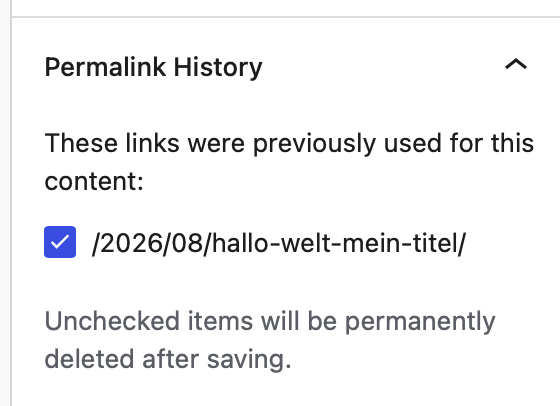

# Permalink History (WordPress-Plugin)

Permalink History remembers every permalink a post, page or term has had and redirects
the old ones to the current URL. It is available on
[WordPress.org](https://wordpress.org/plugins/permalink-history/).

## Why

WordPress itself only redirects a post whose slug changed (`_wp_old_slug`). It does not
help when the permalink structure changes, when a page moves under another parent, or
when a category or tag is renamed - the old URLs simply return a 404, and with them
go bookmarks, links from other sites and search rankings.

## How it works

The plugin keeps its own table, `wp_permalink_history`, with one row per content and
path. A path is added

- when a published or private post is saved,
- when a term is edited (the path *before* the change),
- when a single post or a term archive is viewed, which also catches changes to the
  permalink structure.

Only the path is stored, without the domain. Nothing from before the plugin was
activated is known.

On a 404 the plugin looks the requested path up and redirects with `301` to the current
URL - but only to content a visitor can reach: published posts of viewable post types
and terms of public taxonomies.

In the block editor, the document sidebar has a **Permalink History** panel with the
previous paths of the post. Unchecking one and saving the post deletes that entry for
good, and the old URL returns a 404 again.

Under **Settings → Permalinks**, administrators can generate a redirect map of every
historical URL, for redirecting in the web server before PHP starts.

### Interfaces

| Interface | Access | Returns |
|---|---|---|
| REST field `permalink_history` on public post types | as the post itself; editors can remove entries | the previous paths of the post |
| `GET /wp-json/permalink-history/v1/posts` | public | the history of all publicly visible posts |
| `GET /wp-json/permalink-history/v1/posts/<id>` | public | the history of one publicly visible post |
| `admin-ajax.php?action=permalink_history` with `id`, `path` or neither, optional `contentType=term_taxonomy` | public | as the REST routes; `path` resolves an old path to the current URL |
| `admin-ajax.php?action=permalink_history_map` | `manage_options` and a nonce | the redirect map |
| `wp permalink-history check` | WP-CLI | the number of entries per content type |

| Hook | Type | Purpose |
|---|---|---|
| `permalink_history_find_redirect_before` | filter | return a URL to redirect a path before the history is searched |
| `permalink_history_find_redirect_after` | filter | return a URL for a path the history does not know |
| `permalink_history_redirect_404` | action | runs on a 404 the plugin could not redirect; receives the path |

### Performance

For sites with up to some 30,000 posts there should be no noticeable cost: the table
is indexed for the lookup, and it only runs on a 404. On larger sites, export the
redirect map and redirect in the web server instead.

## Repository layout

`public/` is exactly what ships to wordpress.org; everything else is repository-only.
`Plugin.php` in the root is a development wrapper that loads `public/`, so the whole
repository can be symlinked into `wp-content/plugins` during development. The editor
panel is written in TypeScript in `src/` and compiled into `public/dist/`, which is not
in the repository.

Releases are cut by release-please from conventional commits and deployed to the
wordpress.org SVN by GitHub Actions - see [.github/WORKFLOWS.md](.github/WORKFLOWS.md).
Contribution rules and the local setup are in [CONTRIBUTING.md](CONTRIBUTING.md).

## License

GPL-3.0-or-later, see [LICENSE](LICENSE).
